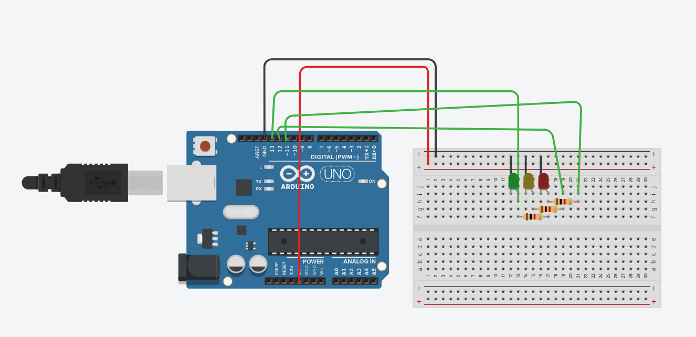

```.c
void setup()
{
  pinMode(13, OUTPUT);
  pinMode(11, OUTPUT);
  pinMode(12, OUTPUT);
}

void loop()
{
  digitalWrite(13, HIGH);
  delay(500); // Wait for 500 millisecond(s)
  digitalWrite(13, LOW);
  delay(500); // Wait for 500 millisecond(s)
  digitalWrite(12, HIGH);
  delay(700); // Wait for 500 millisecond(s)
  digitalWrite(12, LOW);
  delay(700); // Wait for 500 millisecond(s)
  digitalWrite(11, HIGH);
  delay(700); // Wait for 500 millisecond(s)
  digitalWrite(11, LOW);
  delay(700); // Wait for 500 millisecond(s)
  digitalWrite(12, HIGH);
  delay(500); // Wait for 500 millisecond(s)
  digitalWrite(12, LOW);
  delay(500); // Wait for 500 millisecond(s)
  
}

```

The image of the circuit is shown in Fig. 1


Fig. 1 Circuit used for traffic light

3/2/2020
What did we do?
We created an arduino code. We coded and arranged the breadboard so there would be 3 LED lights that represent a traffic light. The lights are supposed to shine in the order of a traffic light
What did we learn?
We learned how to program and code an arduino board, as well as how to upload the circuit board as a PNG file onto GitHub
What questions do I have?
What are the possiblities of Arduino? Does arduino code work the same way as Python?
